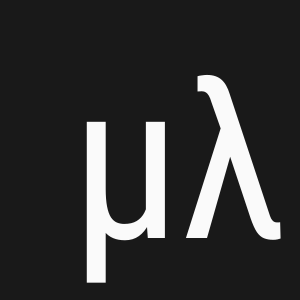
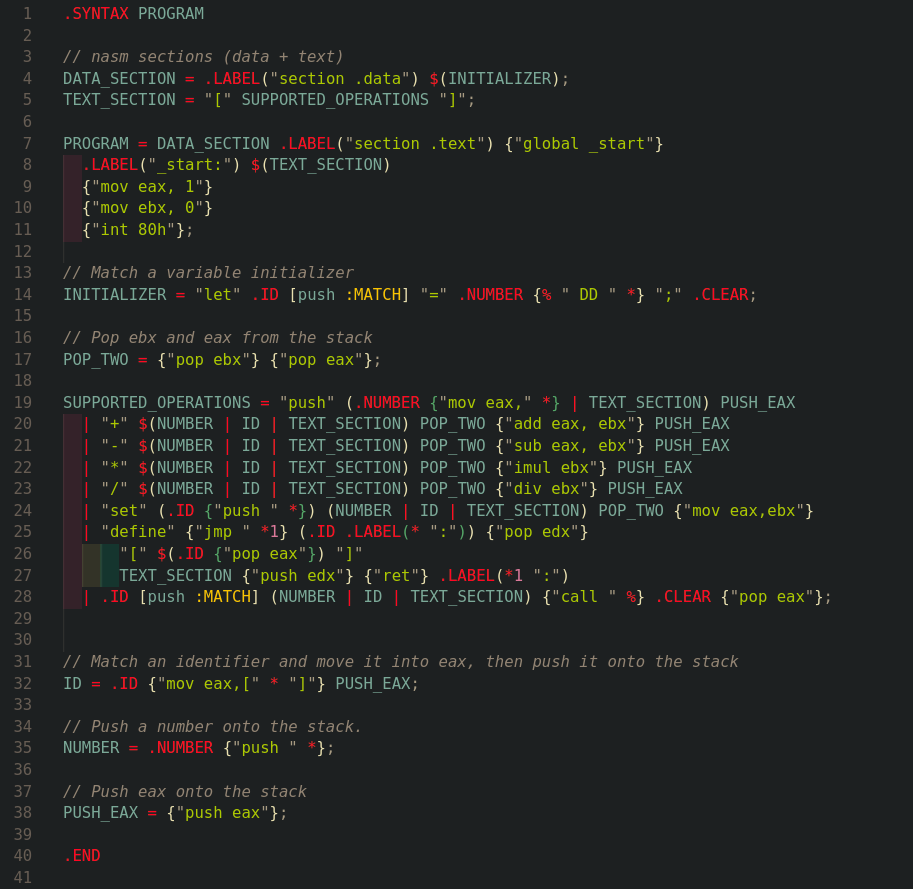

[![Contributors][contributors-shield]][contributors-url]
[![Forks][forks-shield]][forks-url]
[![Stargazers][stars-shield]][stars-url]
[![Issues][issues-shield]][issues-url]

<!-- PROJECT LOGO -->
<br />
<div align="center">
  <a href="https://github.com/the-meta-lang/meta-syntax-highlight">
    
  </a>

<h3 align="center">META Syntax Highlighting</h3>

  <p align="center">
    Syntax Highlighting for the Meta Compiler writing language.
    <br />
    <a href="https://github.com/the-meta-lang/meta"><strong>Explore META »</strong></a>
    <br />
    <a href="https://github.com/the-meta-lang/meta-syntax-highlight/issues">Report Bug</a>
    ·
    <a href="https://github.com/the-meta-lang/meta-syntax-highlight/issues">Request Feature</a>
  </p>
</div>

- [About The Project](#about-the-project)
- [Installation](#installation)
- [Roadmap](#roadmap)
- [Contributing](#contributing)


## About The Project



This extension brings syntax highlighting for the META Compiler writing language to vscode. It includes the full textmate grammar needed for syntax highlighting as well as icons to go along with it.

## Installation

The extension is available for free on the [Visual Studio Code Marketplace](https://marketplace.visualstudio.com/items?itemName=Letsmoe.meta-highlight), you can also install it directly in VSCode by pressing `Ctrl + P` and pasting the following:

```bash
ext install Letsmoe.meta-highlight
```

## Roadmap

In the future we would like to support debugging capabilities directly inside vscode as well as other code editors. If you have any suggestions please open a [new issue on GitHub](https://github.com/the-meta-lang/meta-syntax-highlight/issues/new?assignees=Letsmoe&labels=bug&template=bug_report.md&title=%5BBUG%5D).

- [x] Implement the full META grammar and support basic syntax highlighting.
- [ ] Write a fully fledged language server to support linting.
- [ ] Implement code formatting for better readability.

## Contributing

Contributions are what make the open source community such an amazing place to learn, inspire, and create. Any contributions you make are **greatly appreciated**.

If you have a suggestion that would make this better, please fork the repo and create a pull request. You can also simply open an issue with the tag "enhancement".
Don't forget to give the project a star! Thanks again!

1. Fork the Project
2. Create your Feature Branch (`git checkout -b feature/AmazingFeature`)
3. Commit your Changes (`git commit -m 'Add some AmazingFeature'`)
4. Push to the Branch (`git push origin feature/AmazingFeature`)
5. Open a Pull Request

<p align="right">(<a href="#readme-top">back to top</a>)</p>

[contributors-shield]: https://img.shields.io/github/contributors/the-meta-lang/meta-syntax-highlight.svg?style=for-the-badge
[contributors-url]: https://github.com/the-meta-lang/meta-syntax-highlight/graphs/contributors
[forks-shield]: https://img.shields.io/github/forks/the-meta-lang/meta-syntax-highlight.svg?style=for-the-badge
[forks-url]: https://github.com/the-meta-lang/meta-syntax-highlight/network/members
[stars-shield]: https://img.shields.io/github/stars/the-meta-lang/meta-syntax-highlight.svg?style=for-the-badge
[stars-url]: https://github.com/the-meta-lang/meta-syntax-highlight/stargazers
[issues-shield]: https://img.shields.io/github/issues/the-meta-lang/meta-syntax-highlight.svg?style=for-the-badge
[issues-url]: https://github.com/the-meta-lang/meta-syntax-highlight/issues